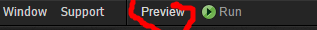
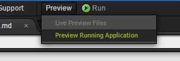
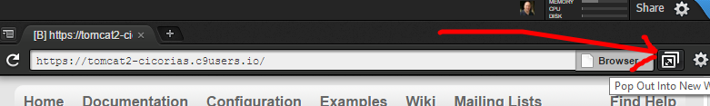
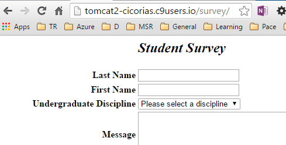

# Working with Cloud 9
Review the Video walkthrough here: [Office Mix](https://mix.office.com/watch/1w8lekdndxjhq)

### Logon to Cloud 8
Go to [http://c9.io](http://c9.io) and logon with GitHub or whatever credentials you choose

### Create your Workspace
Call it whatever you like, but choose "Custom".

### Clone the Repository

```
git clone https://github.com/cs612-f15/tomcat-mysql-c9.git

cd tomcat-mysql-c9

```

## Setting up MySQL
MySQL is already installed.

Run the following from your `~/workspace/tomcat-mysql-c9` directory.

```
./setupMySql.sh
```

## Setting up Tomcat
The following will download V8 of Tomcat and unpack it to `./tomcat`

Run the following from your `~/workspace/tomcat-mysql-c9` directory.

```
./setupTomcat.sh

```

## Building Java classes

Once the Tomcat script is run, the `survey.war` file is deployed to `./tomcat/webapps` and as the Survey site is 
requested, Tomcat extracts the WAR file.


## Make sure you "Run" the site so it expands..

1. Choose "preview" from C9.io interface
2. Preview Running application
3. Popout in New window
3. Change the URL - appending `/survey` to the Server Name










## once the site is run, Tomcat 'expands' the `survey.war` file

This WAR file contains all the content, JSP, Class - and the Java source files.

A helper script allows you build `*.java` source files, then build, then restart tomcat.

```
./buildJava.sh
./tomcat/bin/catalina.sh stop
./tomcat/bin/cataling.sh start
```


Note: JSP files if changes are immediately reprocessed and reflected within Tomcat.
Class files, sourced from Java files, requires a "restart" of Tomcat - that is what the `./tomcat/bin/cataling stop/start` provides.

